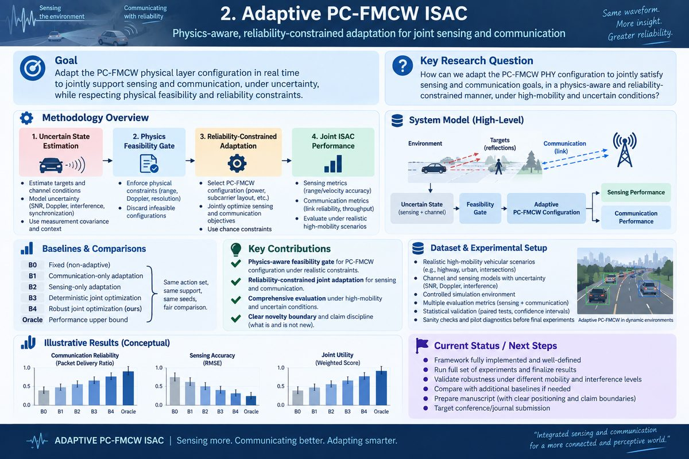

# Physics-Gated Reliability-Constrained Adaptive PC-FMCW ISAC

A reproducible, dataset-free research framework for **high-mobility vehicular phase-coded FMCW integrated sensing and communication (PC-FMCW ISAC)**.



> **Research question:** Which PC-FMCW PHY configurations are physically admissible, and on what subset of operating states can a finite-action adaptive policy support joint communication and sensing QoS with a declared reliability under imperfect PHY knowledge?

The central idea is **physics-gated robust adaptation**. A candidate waveform/profile is first rejected when its modeled FMCW range or unambiguous-velocity support cannot represent the requested operating state. The remaining configurations are evaluated under joint communication and sensing QoS constraints with uncertainty in link quality, Doppler/synchronization, interference, and state estimation.

## Scientific positioning

PC-FMCW sensing/communication is established prior art. This repository does **not** claim invention of phase coding, DPSK embedding, generic ISAC, chance constraints, range--Doppler processing, MIMO PC-FMCW, or receiver filtering. Its narrower contribution is the composition of:

- deterministic PC-FMCW physical-capability gating;
- finite-action PHY adaptation under declared uncertainty;
- explicit policy abstention;
- paired receiver-level evaluation with confidence-qualified reliability statements; and
- feasible-operating-region / reliability--availability--complexity characterization.

The project studies an **RF/mmWave 77-GHz PC-FMCW PHY**. It does not perform trajectory forecasting, packet scheduling, beam management, adaptive-driving-beam control, or ego-motion planning.

The strongest supported interpretation is:

> Under the declared simulation uncertainty model, the robust policy selects a smaller operating subset than deterministic adaptation, but its selected subset exhibits higher confidence-qualified conditional joint sensing/communication reliability. This is a reliability--availability--complexity trade-off, not universal policy dominance.

## Literature-grounded profiles

### Short-range TI parking-style profile

The source-grounded short-range profile follows Texas Instruments reference design **TIDEP-01011** / design guide **TIDUEO9** and uses:

- carrier: 77 GHz;
- valid sweep bandwidth: 858 MHz;
- programmed chirp slope: 40 MHz/us;
- ADC/chirp capture interval: 25.6 us;
- chirp repetition interval: 115.8 us;
- IF ADC: 10 MSPS;
- 256 samples/chirp and 64 chirps/frame.

The valid sweep bandwidth and programmed chirp slope are separate source quantities. The implementation therefore uses **858 MHz** for range resolution and **40 MHz/us** for beat-frequency/range-support calculations; it does not infer the slope as `858 MHz / 25.6 us`.

Derived analytical scales are approximately:

- range resolution: **0.175 m**;
- positive-IF range support: **18.74 m**;
- radial-velocity resolution: **0.263 m/s**;
- maximum unambiguous radial velocity: **8.41 m/s**.

### High-mobility capability profile

A separate **composite capability reference** uses 77 GHz, 1 GHz sweep bandwidth, 20 us ramp/repetition, 37.5 MSPS sampling, 750 samples/chirp, and 128 chirps/frame. It is not represented as a commercial preset.

Its analytical scales are approximately:

- range resolution: **0.150 m**;
- positive-IF range support: **56.21 m**;
- radial-velocity resolution: **0.760 m/s**;
- maximum unambiguous radial velocity: **48.67 m/s**.

Parameter provenance is documented in [`docs/LITERATURE_GROUNDED_PARAMETERS.md`](docs/LITERATURE_GROUNDED_PARAMETERS.md).

## Signal-path model

The radar ADC samples the **dechirped IF/beat signal**, not the 77-GHz carrier. The sensing path uses monostatic two-way delay and Doppler, while the communication path is a separate one-way link. The communication receiver removes the known chirp and decodes a transparent multi-chip DBPSK reference signal.

The DBPSK implementation is checked against the analytical noncoherent AWGN expression `P_b = 0.5 exp(-Eb/N0)`. Residual synchronization/frequency error, interference, state uncertainty, and sensing IF-SNR are controlled experimental variables. No RF measurements are produced by this repository.

## Policies

- **B0 — Fixed PHY**
- **B1 — Communication-only adaptation**
- **B2 — Sensing-only adaptation**
- **B3 — Deterministic joint adaptation**
- **B4 — Robust joint adaptation**
- **Oracle — hindsight true-state reference; non-deployable**

The finite action space spans profile choice, 16/32/64 phase-code chips per chirp, 0/3/6 dB transmit-power backoff, and repetition factors 1/2/4.

## Frozen primary evidence

The publication-v2.1 frozen paired benchmark uses **1000 final seeds**, **12,000 paired operating-state/seed units per policy**, and **72,000 receiver-level evaluations** across six policies.

Key frozen results:

- B4 selection rate: **12.23%**;
- B4 selected successes: **1468/1468**;
- one-sided 95% Wilson lower bound for B4 conditional joint QoS: **99.816%**;
- B4 abstention: **87.77%**;
- B4--B3 unconditional joint-QoS difference: **-0.03942**, 95% paired-bootstrap CI **[-0.04292, -0.03600]**.

Thus the frozen evidence rejects unconditional B4 superiority. The robust policy is more conservative and exchanges availability for conditional reliability.

## Reviewer-grade supplemental evidence

The completed supplemental suite evaluates uncertainty sweeps, impairment stress, physical-feasibility maps, ablations, mismatch, distribution shift, runtime, full metrics, reliability targets, QoS sensitivity, confidence maps, uncertainty-source ablation, finite-draw calibration, and action-space sensitivity.

The historical completed reviewer-grade run `34696063382` is preserved as a distinct evidence instance. A later source-model correction separated the TI programmed slope from valid sweep bandwidth; any post-correction supplemental run must therefore be reported with its own run ID, commit, statistics, and artifact digest rather than silently replacing historical evidence.

The historical full-metric bank showed B4 selecting 12.5% of 1,200 paired states with 100% observed conditional joint QoS and a 98.23% one-sided Wilson lower bound, while B3 selected 20.0% with 80.83% conditional joint QoS. B4 remained worse in unconditional joint QoS by -0.03667 (95% paired-bootstrap CI [-0.04833, -0.02583]).

## Runtime boundary

Historical host-runtime measurements for the unoptimized Python implementation were approximately 36.29, 70.47, 138.89, and 272.81 ms median B4 decision time at 64, 128, 256, and 512 uncertainty draws. At 256 draws, p95 was 279.71 ms.

These are **GitHub Actions host timings**, not embedded-target measurements. No hard-real-time or deployment-latency claim is made.

## Metrics and claim boundaries

The project reports BER, effective rate, range/velocity error, joint QoS, selection/abstention, physical infeasibility, confidence intervals/bounds, resource coordinates, and runtime. **Packet-level PER is not independently estimated because no packet model is declared.** The experiment-defined normalized resource cost is dimensionless and must not be interpreted as physical energy.

Unsupported claims include:

- universal or unconditional B4 superiority;
- RF/hardware validation by this project;
- arbitrary-mismatch or arbitrary-distribution robustness;
- global Pareto optimality outside realized selected points;
- real-time embedded readiness;
- physical-energy interpretation of normalized cost; and
- packet-level PER without a packet model.

See [`docs/research/CLAIM_AUDIT.md`](docs/research/CLAIM_AUDIT.md) and [`docs/research/REFERENCE_VERIFICATION.md`](docs/research/REFERENCE_VERIFICATION.md).

## Reproducibility

```bash
python -m pip install -e .[dev]
pytest -q

python scripts/run_stage7_validation.py \
  --output artifacts/stage7/literature_validation.json

python scripts/run_e6_e12_benchmark.py \
  --output artifacts/publication/smoke.json
```

The GitHub Actions workflows run general CI, LaTeX compilation/audit, frozen publication jobs, and reviewer-grade supplemental evidence. Machine-readable artifacts carry run/commit provenance and are treated as immutable evidence instances.

## Repository layout

```text
configs/                 literature-grounded and frozen experiment configurations
docs/                    system model, positioning, provenance, audits, reproducibility
src/pcfmcw_isac/         waveform, receiver, physics gate, policies, statistics
scripts/                 validation, experiment, evidence, and packaging entry points
tests/                   physical invariants and regression tests
artifacts/                committed diagnostic/frozen machine-readable results
paper/                    manuscript source, tables, discussion, bibliography
```

## Publication status

The computational work is **submission-ready only with its declared claim boundaries and current audited model provenance**. Final submission artifacts must match a commit whose CI, corrected evidence runs, and manuscript LaTeX audit all pass. Any rerun is a new evidence instance and must not silently overwrite prior run IDs, statistics, or digests.
